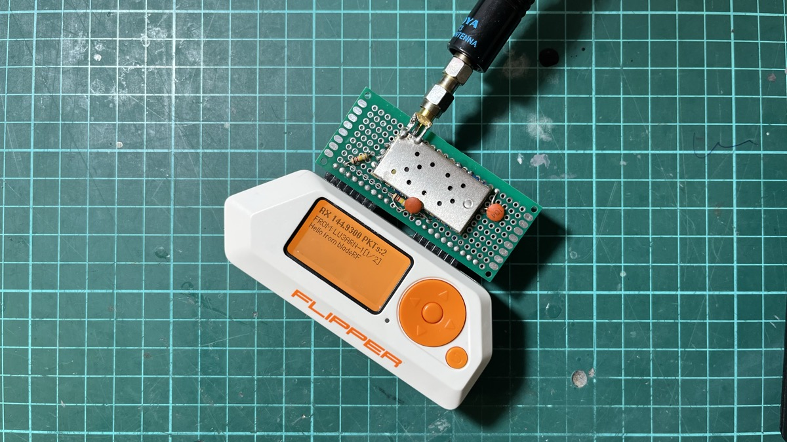

# (DRA/SA) 818 (V/U) APRS Transceiver



APRS transceiver for Flipper Zero using DRA818V/SA818V external VHF/UHF radio modules. Full TX and RX with Bell 202 AFSK at 1200 baud.

By [LU3ARN](https://www.qrz.com/db/LU3ARN). Based on [flipper-ham](https://github.com/yo3gnd/flipper-zero-aprs-tx) by [YO3GND](https://www.qrz.com/db/YO3GND).

## What it does

- **TX**: Sends APRS messages, status packets, bulletins, and position reports on VHF/UHF
- **RX**: Receives and decodes APRS packets in real-time with on-screen display
- **Supported modules**: DRA818V (VHF), DRA818U (UHF), SA818V, SA818U — any module with the standard AT command interface
- **Preset frequencies**: 144.390 (NA), 144.800 (EU), 145.175 (AU), 144.640 (JP), 144.660 (CN), 145.525 (NZ), 432.500 (70cm)

## Hardware required

- Flipper Zero
- DRA818V/SA818V module (or U variant for UHF)
- A few passive components (resistors, capacitors)
- VHF/UHF antenna appropriate for your frequency
- **Optional**: NMEA-compatible GPS module (e.g. NEO-6M) for live position and beacon mode
- **Ham radio license** for your jurisdiction

## Wiring

```
Flipper Zero GPIO              DRA818V/SA818
============================   ================
TX  (PB6)  ─────────────────── RXD
RX  (PB7)  ─────────────────── TXD
B3  (PB3)  ─────────────────── PTT  (active LOW)
B2  (PB2)  ─────────────────── PD   (HIGH = power on)
GND        ─────────────────── GND  (common ground)

Audio TX (Flipper to module):
A4  (PA4)  ──[10k]──[100nF]── MIC+
                                MIC- ── GND

Audio RX (module to Flipper):
                      ┌─[120k]── 3V3
SPK+ ──[100nF cap]───┤
                      ├──────── A6 (PA6)
                      └─[120k]── GND
                     SPK- ──── GND

Power:
3V3 (Flipper)   ────────────── VCC
GND             ────────────── GND
H/L pin         ────────────── GND (low power)
```

The 120k/120k voltage divider on the RX audio biases the ADC input at 1.65V.

### GPS module (optional)

```
Flipper Zero GPIO              GPS Module (NEO-6M or compatible)
============================   ==================================
PC0 (LPUART RX) ───────────── TX
PC1 (LPUART TX) ───────────── RX
3V3             ───────────── VCC
GND             ───────────── GND
```

Any NMEA-compatible GPS module at 9600 baud works. The module connects to the Flipper's LPUART on pins PC0/PC1, leaving the main UART free for the DRA818V.

## Build

```sh
pip install ufbt
ufbt update
ufbt
ufbt launch    # deploy and run on connected Flipper
```

The app appears under **Tools** on the Flipper as **818 APRS Transceiver**.

## Settings

| Setting | Range | Description |
|---------|-------|-------------|
| Freq | Presets | APRS frequency for your region |
| APRS Path | None/WIDE1-1/WIDE2-2/etc | Digipeater path |
| Repeat TX | 1-5 | Number of transmission repeats |
| Lead-in | 0-1000 ms | Mark tone before preamble |
| Preamble | 0-1000 ms | Flag bytes before data |
| Volume | 1-8 | DRA818V audio output level |
| Squelch | 0-8 | RX squelch threshold (0=open) |
| Debug TX | Yes/No | Show packet details during TX |
| Debug RX | Yes/No | Show ADC/CRC/flag stats during RX |

## GPS

Enable GPS under **Settings > GPS Settings**. Once enabled, the module begins parsing NMEA sentences and acquiring a fix.

### Features

- **Live position TX**: Send a one-shot APRS position report using the current GPS coordinates
- **Beacon mode**: Automatic periodic position transmission at a configurable interval
- **GPS status screen**: Real-time display of fix quality, satellite count, coordinates, speed, course, and altitude

### GPS settings

| Setting | Options | Description |
|---------|---------|-------------|
| Enable GPS | Yes/No | Start/stop the GPS serial interface |
| Beacon Interval | 30s / 60s / 120s / 5min / 10min | Time between automatic beacon transmissions |
| GPS Comment | Free text (63 chars) | Custom comment appended to position packets |

Position packets include latitude, longitude, course, speed, altitude, and battery voltage. When no custom comment is set, the packet defaults to `Flipper Zero | Spd:XXkm/h Bat:X.XXV`.

## RX navigation

- **Up/Down** — scroll within a long message
- **Left/Right** — navigate between received messages
- **Back** — exit RX mode

Green LED flashes on successful decode, red on CRC failure.

## Ham usage

Create `/ext/ham/my-callsigns.txt` on the SD card:

```
LU3ARN-9,12345
```

Format: `CALLSIGN[-SSID],PASSCODE` — one per line. The SSID and IS passcode authenticate your transmissions. Select your callsign under **Ham Radio** in the menu.

## How it works

**TX**: The Flipper generates the AX.25 packet (addressing, bit stuffing, NRZI, CRC) and outputs the AFSK waveform as a square wave on GPIO pin A4. The DRA818V's FM modulator transmits it on the configured VHF/UHF frequency.

**RX**: TIM2 hardware timer triggers ADC conversions at exactly 13200 Hz via TRGO. An ISR collects samples into a circular buffer. A worker thread runs a delay-and-multiply discriminator with IIR low-pass filtering, clock recovery, and AX.25 frame assembly. Decoded APRS packets are displayed on screen.

## Testing with BladeRF

A Python script is included for generating test APRS packets via a BladeRF SDR. Requires `numpy` and `bladeRF-cli`.

```bash
pip install numpy
python3 tools/aprs_bladerf_tx.py --freq 144800000 --gain 40 --count 5
```

| Option | Default | Description |
|--------|---------|-------------|
| `--freq` | 144800000 | TX frequency in Hz |
| `--gain` | 20 | BladeRF TX gain |
| `--count` | 5 | Number of packets to send |
| `--call` | TEST01 | Source callsign |
| `--ssid` | 1 | Source SSID |
| `--payload` | `>BladeRF APRS test` | APRS payload (prefix with `>` for status) |
| `--leadin` | 200 | Carrier lead-in before AFSK (ms) |

The script generates Bell 202 AFSK, FM-modulates it, and transmits via `bladeRF-cli` in SC16Q11 format. Verify with OpenWebRX or similar before testing against the Flipper.

## Notes

- Only transmit where you are legally allowed to do so
- The module runs from the Flipper's 3.3V line at low power (H/L tied to GND)
- RX decode rate is ~100% with a clean signal and correct settings

## Credits

- [YO3GND](https://github.com/yo3gnd/flipper-zero-aprs-tx) — original flipper-ham APRS TX app, AFSK waveform generator, AX.25 packet construction
- [LU3ARN](https://github.com/reynico/flipper-818-aprs) — DRA818V integration, VHF/UHF support, RX demodulator, UI overhaul

## License

See [LICENSE](LICENSE) for terms.
